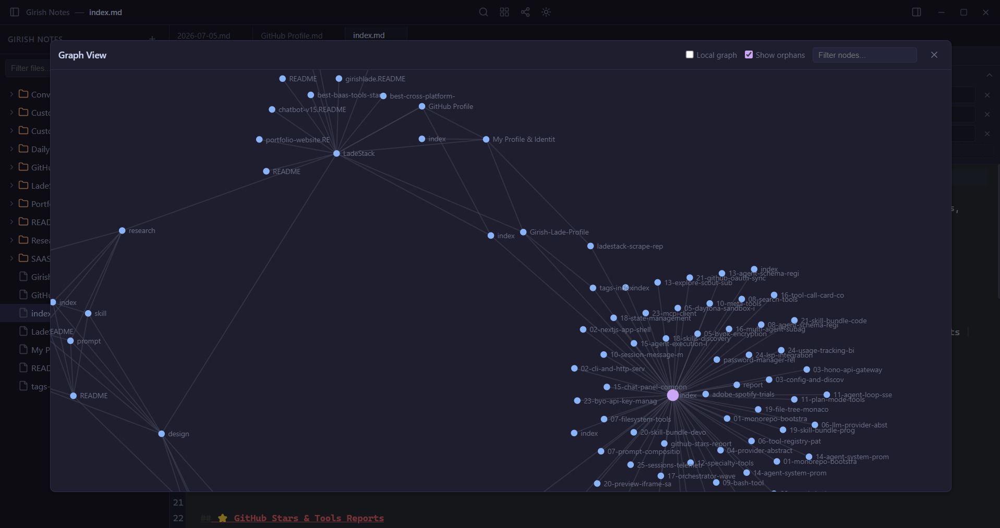

# Granite

A local-first Markdown knowledge management desktop app — fast, private, and portable. Think Obsidian.md, but built with Electron + React + CodeMirror 6.


## Features

- **Markdown Editing** — CodeMirror 6 editor with syntax highlighting, live preview, and frontmatter support
- **Graph View** — Interactive D3-force visualization of note connections via `[[wikilinks]]`
- **Canvas View** — Drag, connect, and arrange notes on an infinite canvas
- **Full-Text Search** — Instant search across all notes with preview snippets
- **Hover Preview** — Hover over `[[wikilinks]]` to see note content inline
- **Plugin Engine** — Extensible plugin system for custom functionality
- **Daily Notes** — Auto-create daily journal entries from templates
- **Template Engine** — Reusable note templates with variable substitution
- **Tag Navigation** — Click tags to filter and browse related notes
- **Settings** — Configurable theme, vault path, and plugin settings

## Screenshots

### Light Theme


The default light theme with a clean, readable interface — sidebar file tree on the left, CodeMirror 6 editor in the center with syntax highlighting, and a tabbed editing experience.

### Dark Theme


A comfortable dark mode for low-light environments, applied across the editor, sidebar, title bar, and all modals.

### Markdown Editor


Full-featured Markdown editing experience with syntax highlighting, live preview, `[[wikilinks]]` autocomplete, and frontmatter support.

### Graph View



Interactive D3-force visualization of your knowledge base — each note is a node and `[[wikilinks]]` connections form the edges. Click any node to navigate, drag to rearrange, and zoom to explore.

### Backlinks & Outgoing Links Sidebar


The sidebar panel shows all incoming backlinks and outgoing `[[wikilinks]]` for the active note, making it easy to navigate your knowledge graph and understand how notes are connected.

## Download

[Download latest release](https://github.com/girishlade111/Granite/releases/latest)

| File | Description |
|------|-------------|
| `Granite.1.0.0.exe` | Portable (no install, run directly) |
| `Granite.Setup.1.0.0.exe` | Installer (adds start menu shortcut) |

## Development

### Prerequisites

- Node.js >= 18
- npm

### Setup

```bash
git clone https://github.com/girishlade111/Granite.git
cd Granite
npm install
```

### Development

```bash
npm run dev
```

Starts Vite dev server + Electron concurrently with hot reload.

### Build

```bash
npm run build
```

Outputs to `release/`:
- `Granite Setup 1.0.0.exe` — NSIS installer
- `Granite 1.0.0.exe` — Portable (single .exe)

### Icons

```bash
npm run icons
```

Generates all PNG sizes + ICO from `assets/icon.svg`.

## Tech Stack

| Layer | Technology |
|-------|-----------|
| Desktop Shell | Electron 33 |
| UI Framework | React 18 |
| Editor | CodeMirror 6 |
| State Management | Zustand |
| Markdown Rendering | react-markdown + rehype/remark |
| Graph Visualization | D3-force |
| Icons | Lucide React |
| Build | Vite + electron-builder |
| Chunk Splitting | Manual: vendor-react, vendor-codemirror, vendor-d3, vendor-markdown |

## Project Structure

```
Granite/
├── assets/              # App icons (SVG, PNG, ICO)
├── public/              # Static assets (favicon, icons)
├── scripts/
│   └── generate-icons.mjs
├── src/
│   ├── main/
│   │   ├── main.js      # Electron main process
│   │   └── preload.js    # IPC bridge
│   └── renderer/
│       ├── App.jsx
│       ├── main.jsx
│       ├── components/   # React components
│       │   ├── CanvasView.jsx
│       │   ├── EditorPane.jsx
│       │   ├── GraphView.jsx
│       │   ├── HoverPreview.jsx
│       │   ├── SearchModal.jsx
│       │   ├── SettingsView.jsx
│       │   ├── ShortcutsHelp.jsx
│       │   ├── Sidebar.jsx
│       │   └── TitleBar.jsx
│       ├── editor/       # CodeMirror editor
│       ├── engine/       # Graph, search, link indexing
│       ├── plugins/      # Plugin engine
│       └── store/        # Zustand store
├── package.json
├── vite.config.js
└── README.md
```

## Keyboard Shortcuts

| Shortcut | Action |
|----------|--------|
| `Cmd/Ctrl + P` | Quick open / search |
| `Cmd/Ctrl + N` | New note |
| `Cmd/Ctrl + S` | Save note |
| `Cmd/Ctrl + W` | Close tab |
| `Cmd/Ctrl + O` | Open folder (vault) |
| `Cmd/Ctrl + \` | Toggle sidebar |
| `Cmd/Ctrl + Shift + C` | Toggle canvas |
| `Cmd/Ctrl + Shift + T` | Toggle theme |
| `Cmd/Ctrl + Shift + N` | New folder |
| `?` | Show keyboard shortcuts help |

## License

MIT
